# Introduction

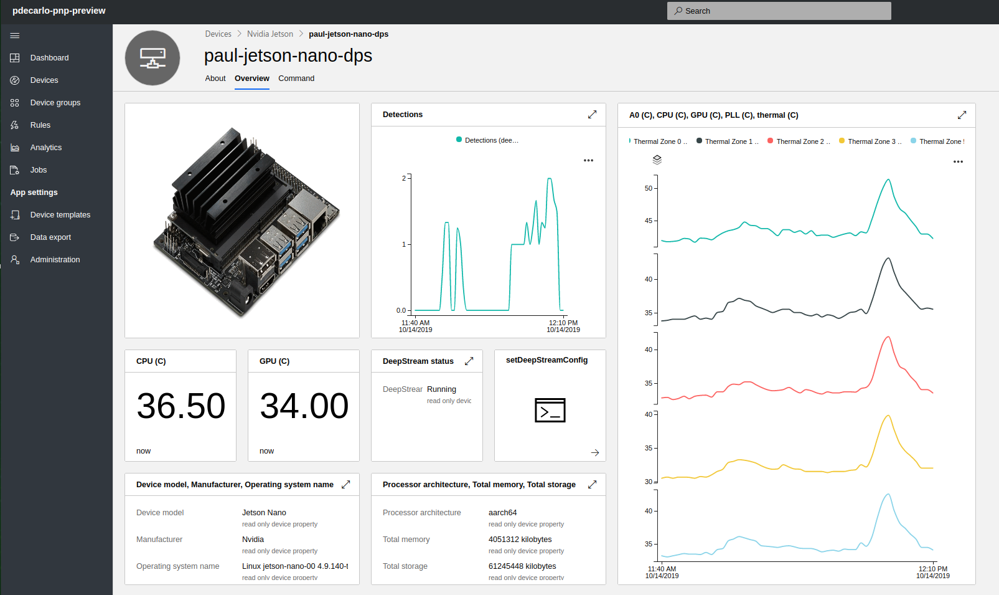

This project contains a set of IoT PnP applications ([nvidia-jetson-dcs](https://github.com/toolboc/azure-iot-nvidia-jetson-deepstream-pnp/tree/master/nvidia-jetson-dcs) & [nvidia-jetson-dps](https://github.com/toolboc/azure-iot-nvidia-jetson-deepstream-pnp/tree/master/nvidia-jetson-dps)) to enable remote interaction and telemetry for [DeepStream](https://developer.nvidia.com/deepstream-sdk) on [Nvidia Jetson Devices](https://www.nvidia.com/en-us/autonomous-machines/embedded-systems/) for use with [Azure IoT Central](https://docs.microsoft.com/en-us/azure/iot-central/?WT.mc_id=github-deepstreampnp-pdecarlo).  

The nvidia-jetson-dcs application accomplishes this using a [device connection string]((https://docs.microsoft.com/en-us/azure/iot-central/quick-create-pnp-device-pnp?toc=/azure/iot-central-pnp/toc.json&bc=/azure/iot-central-pnp/breadcrumb/toc.json?WT.mc_id=github-deepstreampnp-pdecarlo#generate-device-key)) for connecting to an [Azure IoT Hub](https://docs.microsoft.com/en-us/azure/iot-hub/tutorial-connectivity#create-an-iot-hub?WT.mc_id=github-deepstreampnp-pdecarlo) instance, while the nvidia-jetson-dps application leverages the Azure IoT [Device Provisioning Service](https://docs.microsoft.com/en-us/azure/iot-dps/?WT.mc_id=github-deepstreampnp-pdecarlo) within [IoT Central](https://docs.microsoft.com/en-us/azure/iot-central/?WT.mc_id=github-deepstreampnp-pdecarlo) to create a self-provisioning device. 

The content in this README will focus primarily on the nvidia-jetson-dps application to demonstrate how to create a self-provisioning Azure IoT PnP app that can remotely launch DeepStream processing using a custom configuration present on your Nvidia Jetson device. This will enable you to create a cloud configurable Intelligent Video Application with device monitoring and live telemetry in [IoT Central](https://docs.microsoft.com/en-us/azure/iot-central/?WT.mc_id=github-deepstreampnp-pdecarlo).

With this design, you can remotely activate a custom deepstream configuration that leverages an inferencing model of your choice to perform object detection on any available DeepStream input sources including: camera  (USB & CSI), RTSP Streams, and local h.264/5 video files 

## Getting Started

Compiling this project requires building against the current `public-preview` of the azure-iot-sdk-c.  While it is possible to cross-compile this codebase from an AMD64 machine, we  will take advantage of the ARM64 environment present in the Nvidia JetPack OS images to build the included applications.  This will require that you have an Nvidia Jetson device configured with the [latest JetPack offering from Nvidia](https://developer.nvidia.com/embedded/jetpack) and an ability to interact it with the device via ssh or a connected keyboard/mouse/monitor.


1. Installing the Prerequisite software

    All steps below must be performed on the Nvidia Jetson device:

    Begin by installing the dependencies needed for compilation of the azure-iot-sdk-c 
    ```bash
    sudo apt-get update
    sudo apt-get install -y git cmake build-essential curl libcurl4-openssl-dev libssl-dev uuid-dev pkg-config nano
    ```
    We will also need to install node.js and the dps-keygen tool for use in generating a DPS Symmetric Key

    ```bash
    curl -sL https://deb.nodesource.com/setup_10.x | sudo -E bash -
    sudo apt-get install -y nodejs
    sudo npm i -g dps-keygen
    ```

    Finally, we will need to [download the latest DeepStream 4.0.1 .deb installer](https://developer.nvidia.com/deepstream-401-jetson-deb) for your Jetson Device.  This will require that you create an Nvidia Developer Account.  Once you have registered and logged in, you will be presented with the ability to download the SDK using the aforementioned link:

    

    After downloading the .deb, navigate to the directory where the .deb installer was saved (e.g. ~/Downloads) and install it by running the following:

    ```bash
    cd ~/Downloads
    sudo apt-get install ./deepstream-4.0_4.0.1-1_arm64.deb
    ```

    If you have issues installing the DeepStream SDK, refer to [the offical DeepStream Developer Guide](https://docs.nvidia.com/metropolis/deepstream/dev-guide/index.html) for more information.

1. Create an IoT Central Application and obtain the DPS connection parameters

    Complete the [Create an Azure IoT Central application (preview features)](https://docs.microsoft.com/en-us/azure/iot-central/quick-deploy-iot-central-pnp?toc=/azure/iot-central-pnp/toc.json&bc=/azure/iot-central-pnp/breadcrumb/toc.json?WT.mc_id=github-deepstreampnp-pdecarlo) quickstart to create an IoT Central application using the Preview application template.


1. Create a new device template in your Azure IoT Central Application 
    
    Navigate to your newly deployed IoT Central instance at https://apps.azureiotcentral.com

    Select "App Settings => Device templates => New" to create a new Custom Device template

    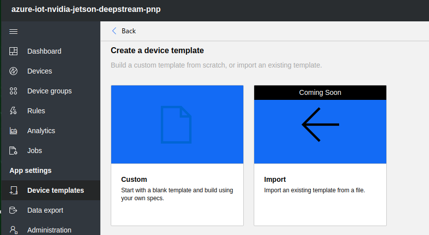    

    Download the [urn_nvidia_jetson_1.capabilitymodel.json file that is included in this repo](https://raw.githubusercontent.com/toolboc/azure-iot-nvidia-jetson-deepstream-pnp/master/urn_nvidia_jetson_1.capabilitymodel.json) (Right-Click and select "Save As...")

    Name the new Device template "Nvidia Jetson" and select "Import Capability Model" then upload the newly downloaded capability model.

    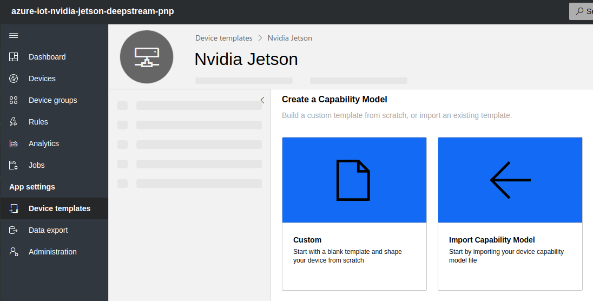       

    This will populate the device model with pre-configured data associated with the device:

    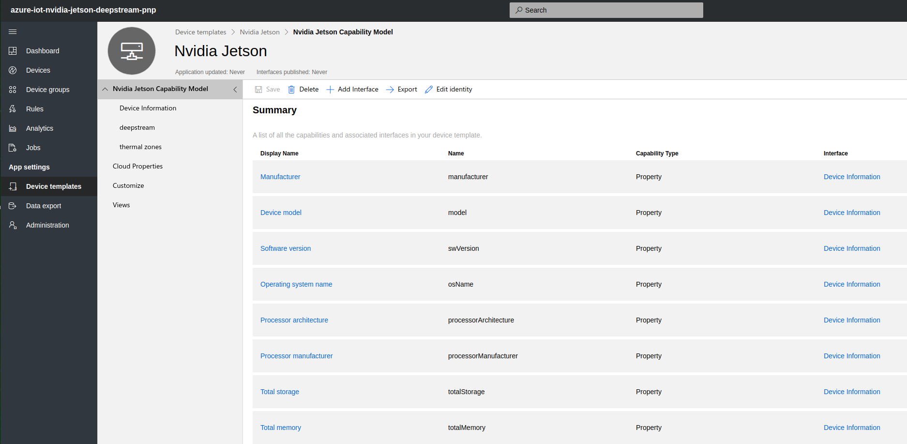   

    To view how these values are determined at runtime, take a look at the [jetson_impl.c file](https://github.com/toolboc/azure-iot-nvidia-jetson-deepstream-pnp/blob/master/nvidia-jetson-dps/jetson_impl.c) included in the pnp application.  Take notice of the [implementation for obtaining the available memory on the device](https://github.com/toolboc/azure-iot-nvidia-jetson-deepstream-pnp/blob/master/nvidia-jetson-dps/jetson_impl.c#L136) and the [implementation to read the onboard temperature sensors](https://github.com/toolboc/azure-iot-nvidia-jetson-deepstream-pnp/blob/master/nvidia-jetson-dps/jetson_impl.c#L141).

    Depending on the device, you may wish to customize the way the thermal zones are displayed to better visualize which 
    portion of the device they correspond to.  This can be determined by printing out the type for all thermal zones with:
    
    ```bash
    cat /sys/devices/virtual/thermal/thermal_zone*/type 
    ```

     For example, on the Jetson Nano, the following mapping can be used:

    | Thermal Zone      | Mapping |
    | -------------- | ------------|
    | Thermal Zone 0     | A0 |
    | Thermal Zone 1     | CPU |
    | Thermal Zone 2     | GPU |
    | Thermal Zone 3     | PLL |
    | Thermal Zone 4     | PMIC |
    | Thermal Zone 5     | thermal |

    We can then update the display name for each of the zones as shown below in the "Customize" section:

    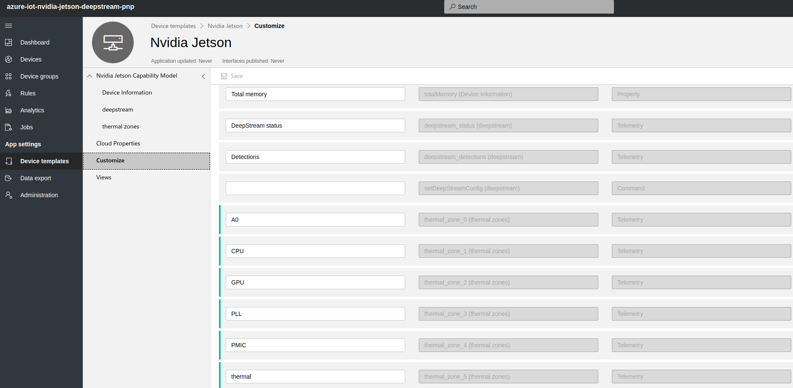   


1. Create custom views for your device in your Azure IoT Central Application 
    
    In this section, we will create a custom view for displaying telemetry from the device and offer and easy interface for command and control.

    In "App Settings => Device Templates" select "Views" => "Generate Default Views" then generate the default views using the default options:

    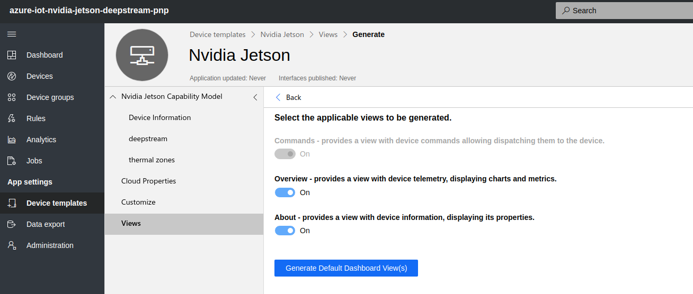   

    This process will analyaze our uploaded device capability model and do a "best effort" to create a viewing dashboard.  Select the Generted "Overview" View and remove all of the windows it has created to start fresh.

    On the left-side panel, drag an "image" view over to the right-side and expand it to be 2x2:

    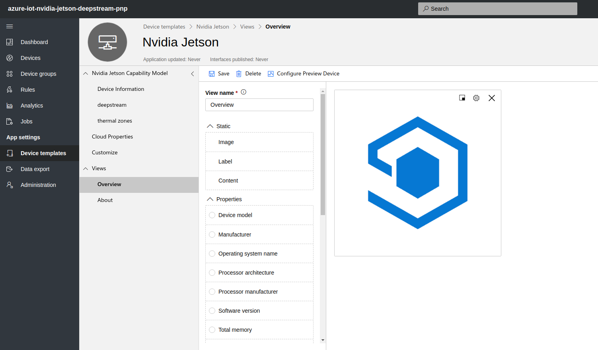  

    Select the "gear" icon to configure and upload an image to correspond to your device and select "Apply":

    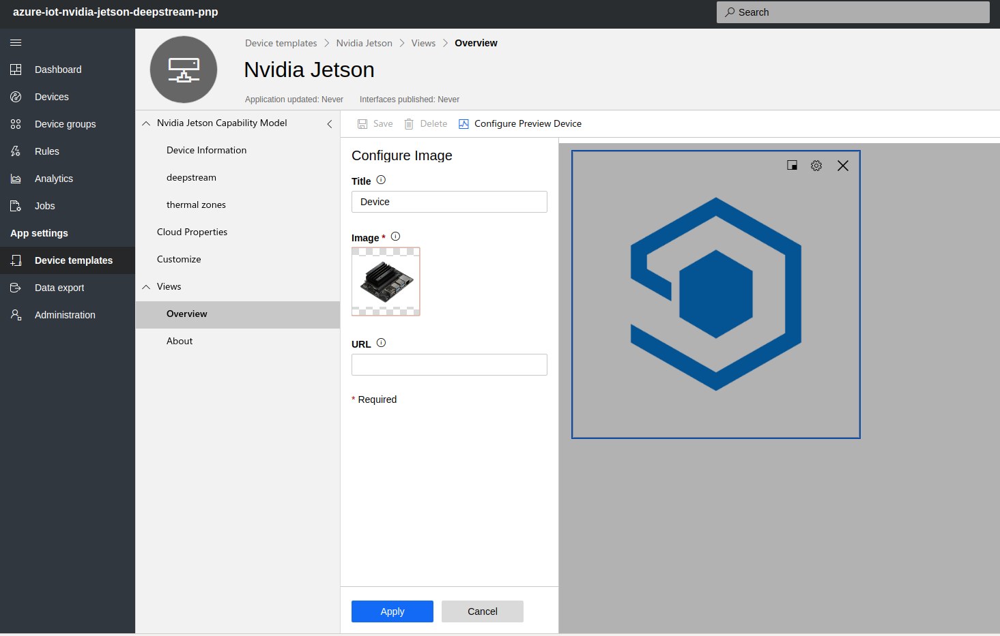  

    Next, from the "Telemetry" section on the left hand side, drag over the CPU and GPU items and shrink them to 1x1:

    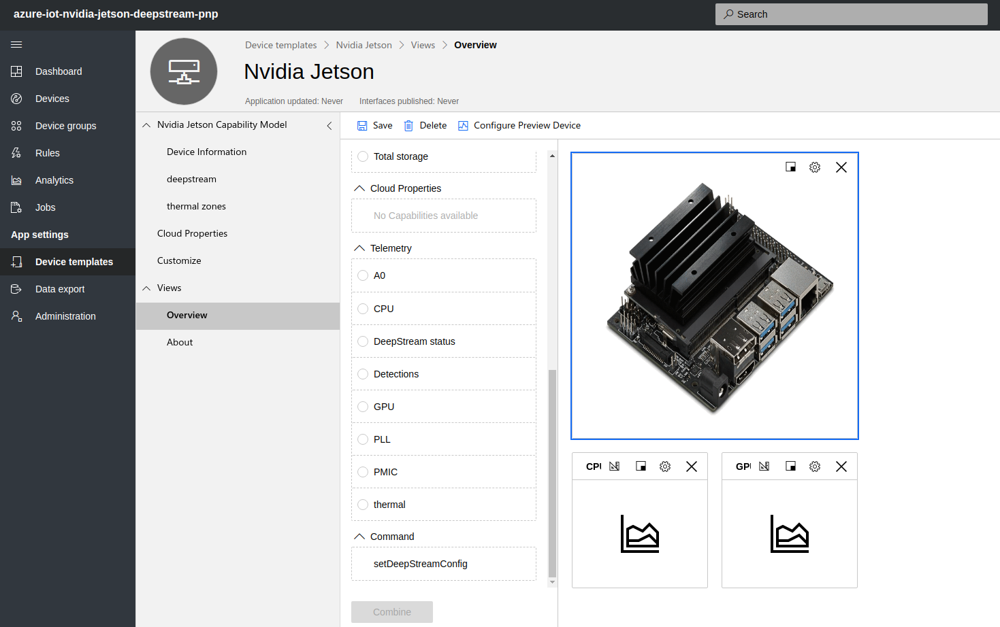

    Select the "measure" icon and configure it to use "Last Known Value" 

    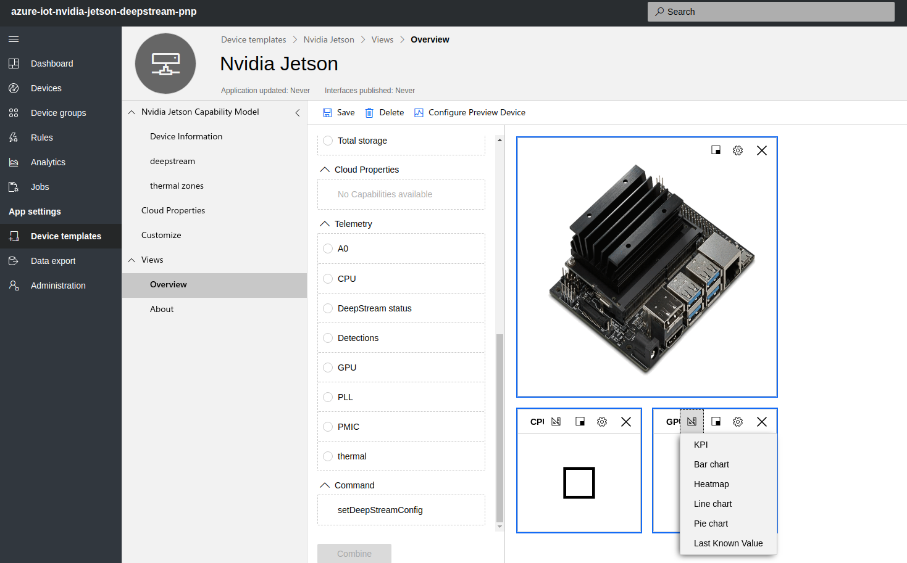

    Next, under "Properties" select "Device model", "Manufacturer", and "Operating System" then select "Combine" and shrink the result to 2x1:

    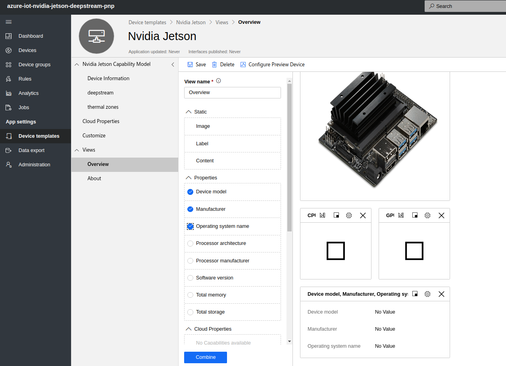

    From the "Telemetry" section, drag over the "Detections" and place it next to your image as shown, then configure it to use "Line Chart":

    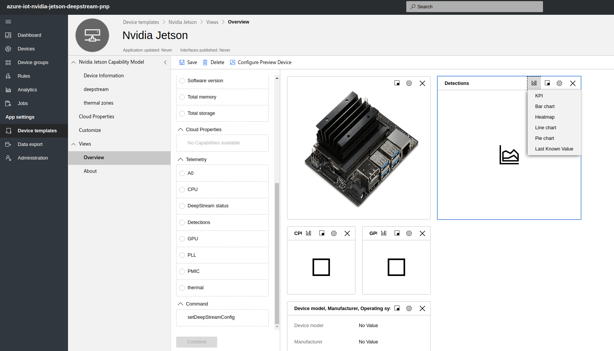

    Next, from the "Command" section, drag over the "setDeepStreamConfig" command and expand it to 2x1:

    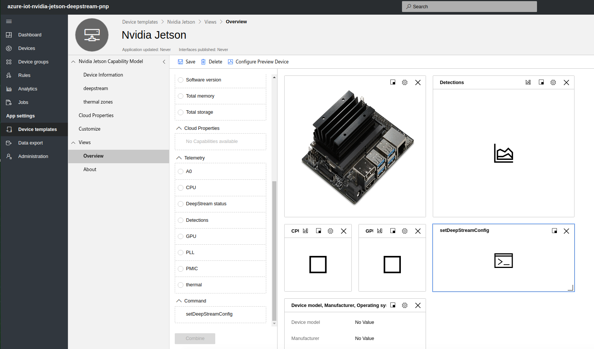


    Under "Properties" select "Processor manufacturer", "Total memory", and "Total Storage" then select "Combine" and shrink the result to 2x1:

    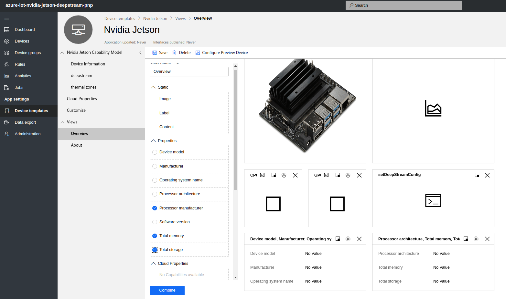

    Finally, from the "Telemetry" section, select "A0", "CPU", "GPU", "PLL", and "thermal" **not PMIC** and configure it to use "Line Chart" and expand it to 3x4:

    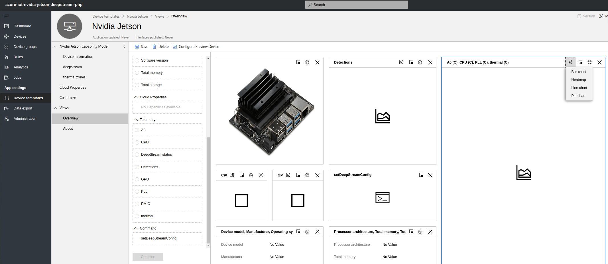

    At this point, feel free to play around and customize to your desire, there are additional properties and visualiztions that can be used.  Once you are satisfied, select "Save".

    The last step if very important as DPS will fail to register your device if the capbility model has not been published!  Select "Publish" from the upper right then select "Publish" again on the resulting prompt:

    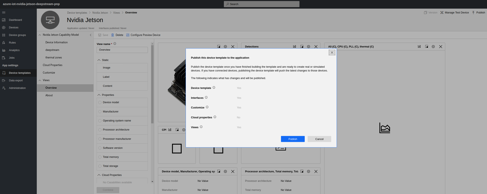

    We are now ready to build and test the pnp application against our uploaded capability model and view it's telemetry in the Views we created.

1. Building the PnP Application

    Clone the preview release of the SDK to your home directory using the `public-preview` branch
    ```bash
    cd ~
    git clone https://github.com/Azure/azure-iot-sdk-c --recursive -b public-preview
    ```
    > The `--recursive` argument instructs git to clone other GitHub repos this SDK depends on. Dependencies are listed [here](https://github.com/Azure/azure-iot-sdk-c/blob/master/.gitmodules).

    Navigate into the newly created folder containing the contents of the azure-iot-sdk-c and copy this repo inside of it with:
    ```bash
    cd ~/azure-iot-sdk-c
    git clone https://github.com/toolboc/azure-iot-nvidia-jetson-deepstream-pnp.git
    ```

    Open the `CMakeLists.txt` in the **azure-iot-sdk-c** folder and modify it to include the **azure-iot-nvidia-jetson-deepstream-pnp** folder so that the pnp applcations will be built together with the Device SDK. To do this, run:
    ```bash
    nano ~/azure-iot-sdk-c/CMakeLists.txt 
    ```

    Add the following lines to the very end of the file:
    ```txt
    add_subdirectory(azure-iot-nvidia-jetson-deepstream-pnp/nvidia-jetson-dcs)
    add_subdirectory(azure-iot-nvidia-jetson-deepstream-pnp/nvidia-jetson-dps)
    ```

    Save the file by pressing "CTRL+X" and press "Y" when prompted to save.

    In the same **azure-iot-sdk-c** folder, create a folder to contain the compiled app.
    ```bash
    cd ~/azure-iot-sdk-c
    mkdir cmake
    cd cmake
    ```

    In the **cmake** folder you just created, run CMake to build the entire folder of Device SDK including the PnP app code.
    ```bash
    cmake .. -Duse_prov_client=ON -Dhsm_type_symm_key:BOOL=ON -Dskip_samples:BOOL=ON
    cmake --build . --config Release
    ```

1. Retrieve the DPS connection information from Azure IoT Central, including [DPS ID Scope], [DPS Symmetric Key], and [device ID]. 

    These values will be passed as parameters to the nvidia-jetson-dps application executable. To obtain these, you may reference the [steps to Generate a device key](https://docs.microsoft.com/en-us/azure/iot-central/quick-create-pnp-device-pnp?toc=/azure/iot-central-pnp/toc.json&bc=/azure/iot-central-pnp/breadcrumb/toc.json#generate-device-key?WT.mc_id=github-deepstreampnp-pdecarlo) then follow the steps below.

    [DPS ID Scope] is obtained from the "Administration => Device Connection" section of your IoT Central Application.  

    

    Once you have obtained the Primary Key, execute the following: 

    (Note: the value for -di can be any name of your choosing and will become the name registed to IoT Central when the application is first run)

    ```
    dps-keygen -di:jetson-device -mk:{Primary Key from IoT Central}
    ```

    The value used for -di becomes [device ID] and the output of executing the above command becomes [DPS symmetric key] (i.e. **not** the value of the Primary Key)
    

1. Running the PnP Application

    Once the build has succeeded and you have the DPS connection information, you can test the pnp app by invoking it with the appropriate parameters.

    To pass the DPS info as command line parameters, modify the following line with the values obtained in the previous step:
    ```bash
    ~/azure-iot-sdk-c/cmake/azure-iot-nvidia-jetson-deepstream-pnp/nvidia-jetson-dps/nvidia-jetson-dps [DPS ID Scope] [DPS symmetric key] [device ID]
    ```

    With the application running, navigate to "Devices" and you should see your newly registered device, if this fails, double-check that you have published the capability model and produced a proper key with dps-keygen:

    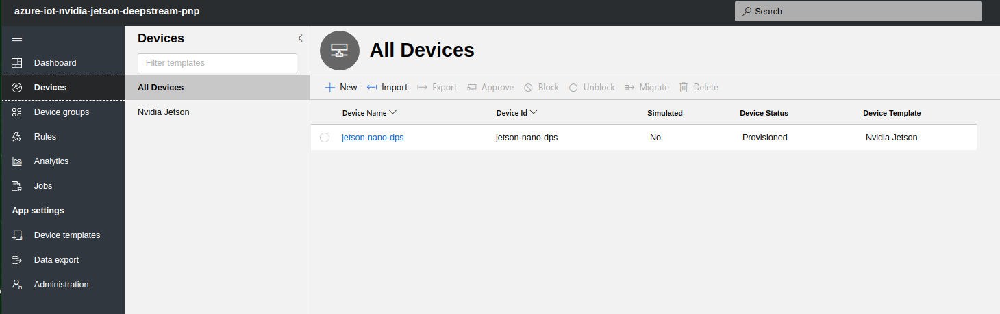

    Select the device to be presented with the "About information" published by the pnp application:

    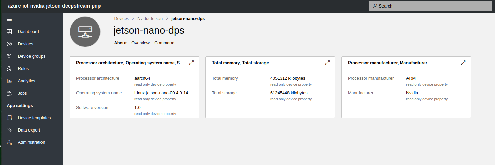

    Select "Overview" to be presented with your custom view:

    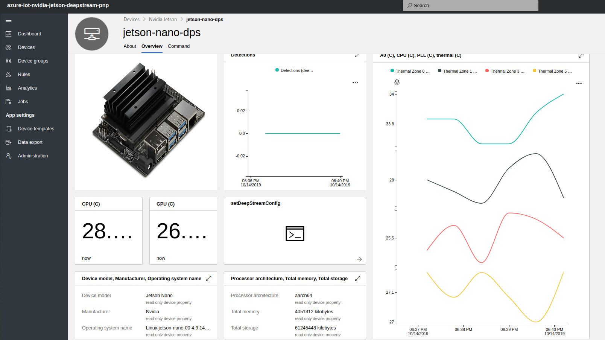

1. Configuring DeepStream from IoT Central

    In this section, we will configure DeepStream on the device from IoT Central using a sample configuration included in this project.  As-is, this configuration takes input from an attached webcam and processes it using a Resnet model to detect people, cars, bicycles, and road signs.  
    
    You will need to plug in a compatible USB webcam, if you would like to test the configuration while connected to a monitor, you can run the following:

    ```bash
    deepstream-app -c ~/azure-iot-sdk-c/azure-iot-nvidia-jetson-deepstream-pnp/deepstream/configs/deepstream-app/source1_usb_dec_infer_resnet_int8_windowed.txt 
    ```
    
    If the deepstream-app starts without issues and continues running, you can be assured that the configuration and your webcam are working.  You can terminate the application by pressing "CTRL+C"

    If you are not connected to a monitor, you will want to run the following:

    ```bash
    deepstream-app -c ~/azure-iot-sdk-c/azure-iot-nvidia-jetson-deepstream-pnp/deepstream/configs/deepstream-app/source1_usb_dec_infer_resnet_int8_novisual.txt 
    ```

    Verify that the deepstream-app can start with either of these configurations, once you have concluded that the configuration is good, we can now set it from IoT Central.

    Ensure that your pnp app is still running, if it is not, restart it again using the same parameters as before.  Next, navigate to your device in IoT Central and select the "Commands" tab. You should see the following:

    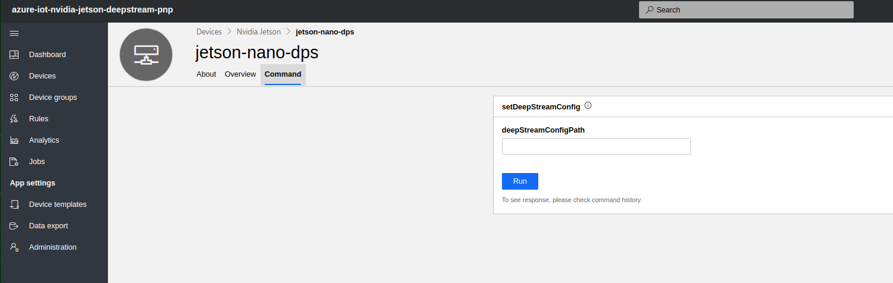

    Paste in the following value to set the DeepStream configuration path and begin producing telemetry for detected objects from the attached USB camera's video stream:

    ```
    ~/azure-iot-sdk-c/azure-iot-nvidia-jetson-deepstream-pnp/deepstream/configs/deepstream-app/source1_usb_dec_infer_resnet_int8_novisual.txt 

    ```

    You should see the deepstream-app startup output appear in the PnP application output.  After a short while, the app will begin detecting objects using the included configuration which will appear in the "Detections" section of your "Overview" View.  After you have verified this is working, you are ready to customize the configuration to your needs.  
    
1. Customzing the PnP Application

    For a reference to additional sample configurations, you may peruse the samples included with the DeepStream SDK on your device at /opt/nvidia/deepstream/deepstream-4.0/samples/configs/

    To use a custom DeepStream configuration, it is important that you have the following option enabled `gie-kitti-output-dir` and set to '/tmp/deepstream-detections-output-dir' in your configuration as shown [here](https://github.com/toolboc/azure-iot-nvidia-jetson-deepstream-pnp/blob/master/deepstream/configs/deepstream-app/source1_usb_dec_infer_resnet_int8_novisual.txt#L12).  The PnP app expects primary detector output to appear in this specific path so this must be set if you wish to use a custom configuration.  Please refer to the official [DeepStream Configuration Groups documentation](https://docs.nvidia.com/metropolis/deepstream/dev-guide/index.html#page/DeepStream_Development_Guide%2Fdeepstream_app_config.3.2.html) for more customization options.  
    
    With minor modification, you can specify a custom model by [changing the primary detector](https://github.com/toolboc/azure-iot-nvidia-jetson-deepstream-pnp/blob/master/deepstream/configs/deepstream-app/source1_usb_dec_infer_resnet_int8_novisual.txt#L98), or [take input from a different video source](https://github.com/toolboc/azure-iot-nvidia-jetson-deepstream-pnp/blob/master/deepstream/configs/deepstream-app/source1_usb_dec_infer_resnet_int8_novisual.txt#L24), or [modify how output is displayed at runtime (or not displayed)](https://github.com/toolboc/azure-iot-nvidia-jetson-deepstream-pnp/blob/master/deepstream/configs/deepstream-app/source1_usb_dec_infer_resnet_int8_novisual.txt#L34).  Do be aware that the pnp app does not have access permissions to X11 by default so you may encounter issues if using the EglSink option for output, this is why a windowed and novisual variant exist for the sample configuration.
    


